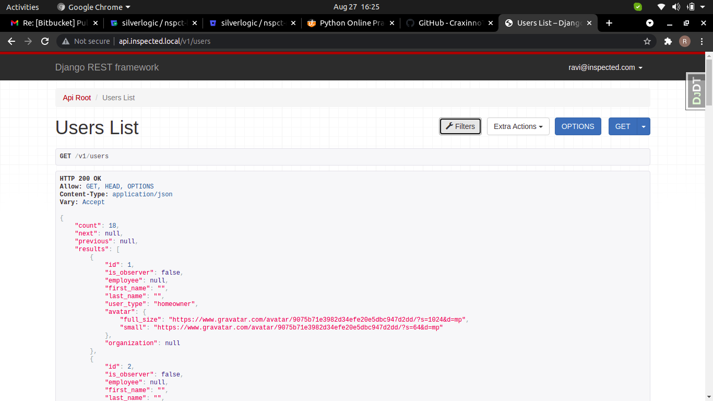

## Welcome to the Python Hiring Exercise

Awesome!  Are you excited?  Pumped up?  Ready to go?  Great!

### What is this?

We want to be sure that we're on the same page as far as your ability and our expectations of you, and so have this exercise that we use for a few reasons:

- To get a sense for how you write code
- To get a sense for how you test code
- To get a sense for how we can communicate with you about your code

So we put together this exercise that usually takes on the order of 60-90 minutes to do.  Don't overthink it.

### Requirements

- You should start a new project using django-admin startproject project_name or any name
- you can use to requirement file for fullfil this task
- Immediately mark an initial commit - this will serve as a starting point
- On completion, create a commit called "code-complete"
- Feel free to do refactoring/debug improvements after that point in further commits
- The components should be tested

#### The Task is Create API and Test by test case using (PyTest, rest_framework Test any other)

1. Create a Custom User Model.
    - email : Email Field
    - phone_number : Char Field
    - status : Boolean Field
    - user_type : ChoiceType Field
    - super_user : Boolean Field
    - DOB : Datetime Field
    - create_date : Datetime Field
    - update_date : Datetime Field
    
    a.) create method to get fullname for user
        
        example:

        firstName: Rohit Lastname: Sharma
        fullname Rohit Sharma

    b.) Create a method to get age
        
        Hint: current_date - DOB [only year]

2. User API for List/Create/Update/DELETE.
 
    Endpoints
        a.) all users list   
            v1/users

        b.) SELECT / UPDATE / DELECT user
            v1/users/<int:pk>

3. Create TestCase for Users Model.

    TestUserRetrive 
 
    - guest can retrive through pk details
    - user can retrive through pk details
    - user can retrive through keys

    TestUserUpdate
 
    - guest can update through pk 
    - user can update through pk
    - user can update through keys 
    - user can't update email

    TestUserList
 
    - guest can list users 
    - user can list users 
    - search any user in listed user
    

### Submitting

- Push this repository to github
- Email ravi_craxinno@outlook.com with the location of the repository - if you would like it to be private, then add the github user `ravi-craxinno` as a collaborator
- We will review the code within 24 hours and we can discuss it in github

### Criteria

- Clarity
- Adherence to "standards"
- Testing methodology/coverage
- "Does it work"
- Time to complete
- Attached is a screenshot of the version of this exercise that we built.  This is an intentionally graphically bare version of the project to communicate the main components.

